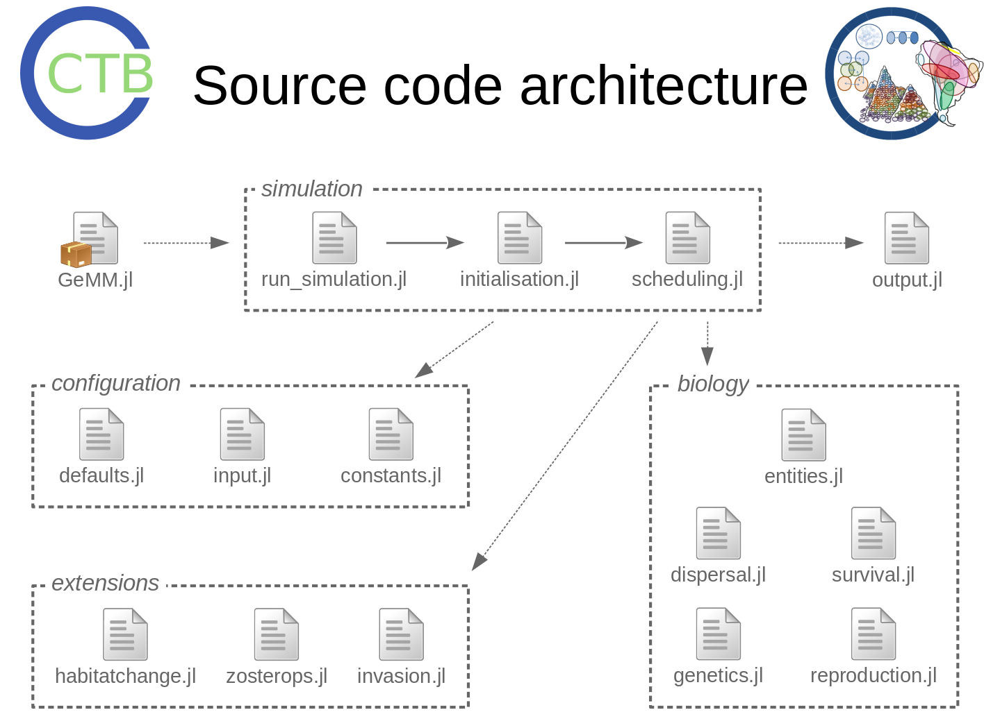

# Software Architecture

## Biological entities and processes

As an individual-based model, the core component of GeMM are individual organisms.
These are abstract entities generally thought of as plants, but can also be animals, 
as in the *Zosterops* bird study. All individuals have a genome consisting of one
or more chromosomes, which in turn hold genes, each of which have a base pair sequence
and a list of traits they code for. An organism's phenotype (i.e. its set of trait values)
is calculated from this genome.

The model also has a landscape consisting of a rectangular grid of patches. Each
patch is characterised by a local temperature and habitat value, as well as
a carrying capacity. The temperature is important because the model uses the
Metabolic Theory of Ecology to simulate several of its processes, and this is
influenced by the temperature. The habitat value is a generic niche parameter,
variously interpreted as "precipitation" (this is its name in the source code)
or a measure of forest cover. The carrying capacity determines the maximum biomass
or maximum number of individuals the patch can sustain.

The base processes included in the model are dispersal and establishment, survival,
growth, and reproduction. Depending on the study, additional processes are included,
namely competition, disturbance, or invasion. Some processes are implemented
differently for different studies. Specifically, the *Zosterops* studies reimplement
reproduction and dispersal.

## Source code overview

GeMM is constructed as a Julia package that can be loaded and run from within
another Julia program. For a minimum working example, see `rungemm.jl`.
The image above shows all source files in the main model (in the `src` folder)
and their relation to one another.

The flow of program control passes from `run_simulation.jl` (called with
the function `rungemm()`) to `initialisation.jl`, which sets up each new
model landscape, and finally to `scheduling.jl`, which cycles through the
ecological processes.

All data output are done by `output.jl`, which is mostly called by the `simulate!()`
function in `scheduling.jl`. All parameter values and their defaults are stored in 
`defaults.jl` and `constants.jl`. Configuration and map files as well as commandline 
arguments are read by `input.jl`.

The remaining files contain the model logic, or the "actual biology". Class definitions
are in `entities.jl`. (Note that Julia does object-oriented programming rather differently
from the approach in Java et al., see its [type documentation](https://docs.julialang.org/en/v1/manual/types/)
for details.) Core ecological processes are in `genetics.jl`, `reproduction.jl`,
`dispersal.jl`, and `survival.jl`. Additional processes or process reimplementations
for specific studies are in `habitatchange.jl`, `invasions.jl`, and `zosterops.jl`.

Auxiliary code for the studies may be found in the `studies` folder. This includes map
inputs, configuration files, and analysis scripts. Often, there are also automation
scripts to generate the appropriate config files and start the simulation runs.
